## Word文档（*.docx）-书签解析转化成Yigo单据的功能说明

### 1.正文书签设置
- 正文书签设置必须符合如下结构:${controlltype}_${key}_${caption}或${controlltype}_${key}_${caption}_${selector}_${S/E}
   - `controlltype` 控件类型
   - `key` 控件的key,禁止重复
   - `caption` 单据界面上显示名称
   - `selector` 如果是选项书签,必须指定对应选项控件的`key`
   - `S/E` 如果是选项书签,必须指定是开头还是结尾
   
- `controlltype`,控件类型,目前分为
   - `TEXT` 文本型控件
   - `SELECT` 下拉型控件
   - `SHOW`文本型控件,通过系统自动生成,结合`SELECT`标签
   - `LONG` 数字型控件,长整型
   - `INT` 数字型控件,整型
   - `NUMBER` 数字型控件,BigDecimal
   - `DATE`日期型控件
   - `DATETIME`日期型控件
   - `OPTION` 选项型
   
- 如果`controlltype`为`OPTION`, 则表示该书签为选项型,那么就必须指定`selector`,`selector`即为之前以`SELECT`为类型的书签,且必须指定是选项内容的开头/`S`，还是结尾/`E`,此外,选项书签会自动归集到`SELECT`书签下,成为下拉选项之一

   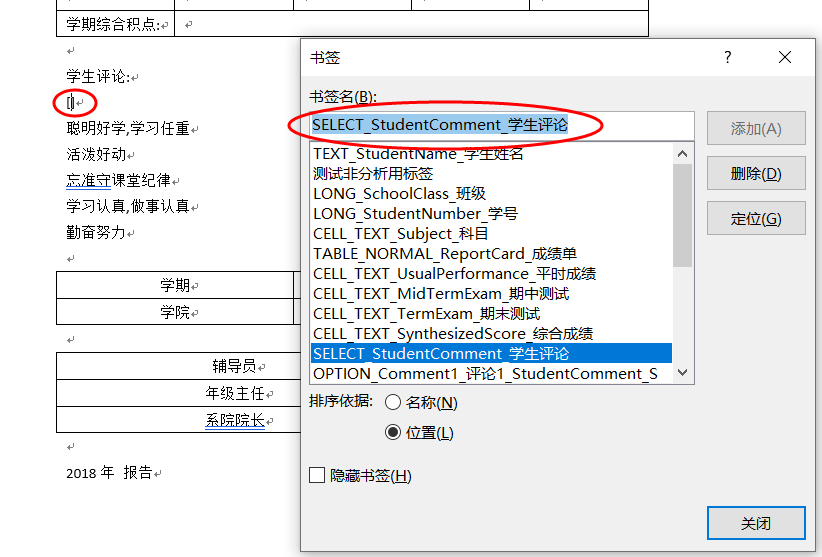
   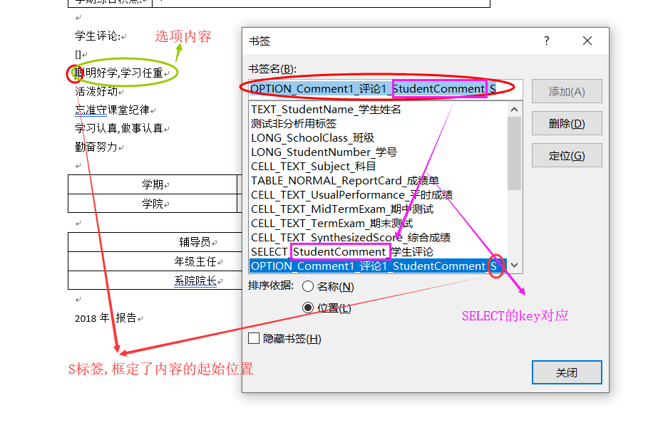
   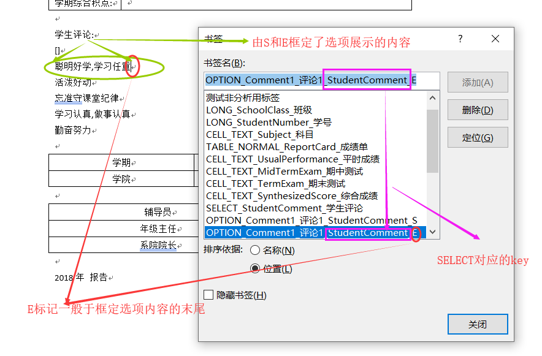
   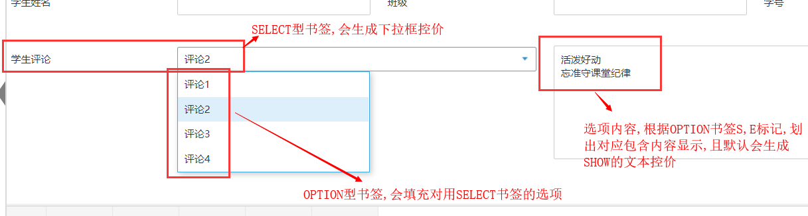

- 其他普通书签
   - TEXT型书签 
   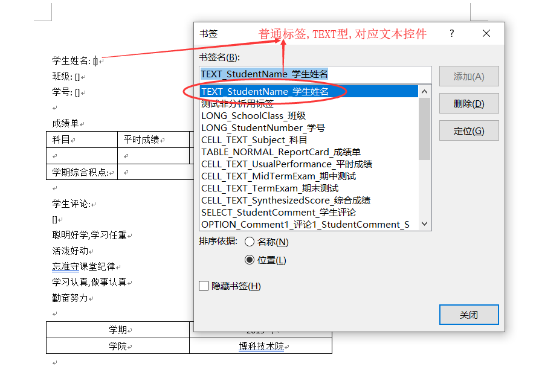
   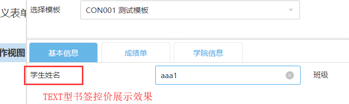
   - LONG型书签
   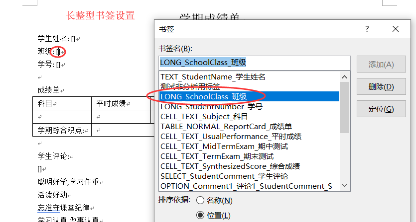
   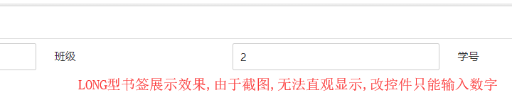
   - DATE型书签
   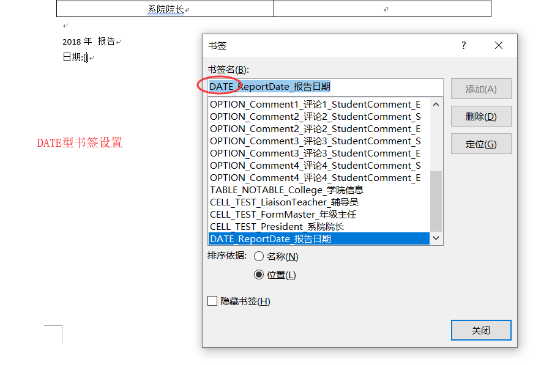
   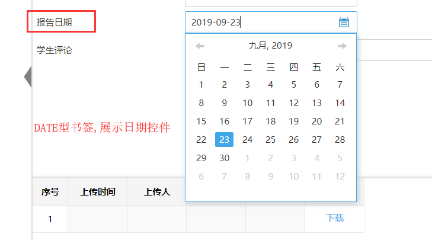

### 表格书签设置
- 必须在表格第一行第一个列或整个表格选中添加表格类型书签,否则忽略该表格的解析
- 表格类型分为`NORMAL`,`NOTABLE`,`ALLFIXED`
   - `NORMAL` 普通表格,即第一行为数据,剩下暂定为固定行
   - `NOTABLE` 从表格中读取解析,但放在主表显示
   - `ALLFIXED` 从表格中读取解析,但全表为固定行
- 表格类型书签格式:`TABLE_${tableType}_${key}_${caption}`
   - TABLE 固化,其实,这个更类似`controlltype`的含义
   - tableType,具体表格类型,上述已经说明了
   - key 表格的key,请不要重复
   - caption 表格展示的名称
- 已下是示例 
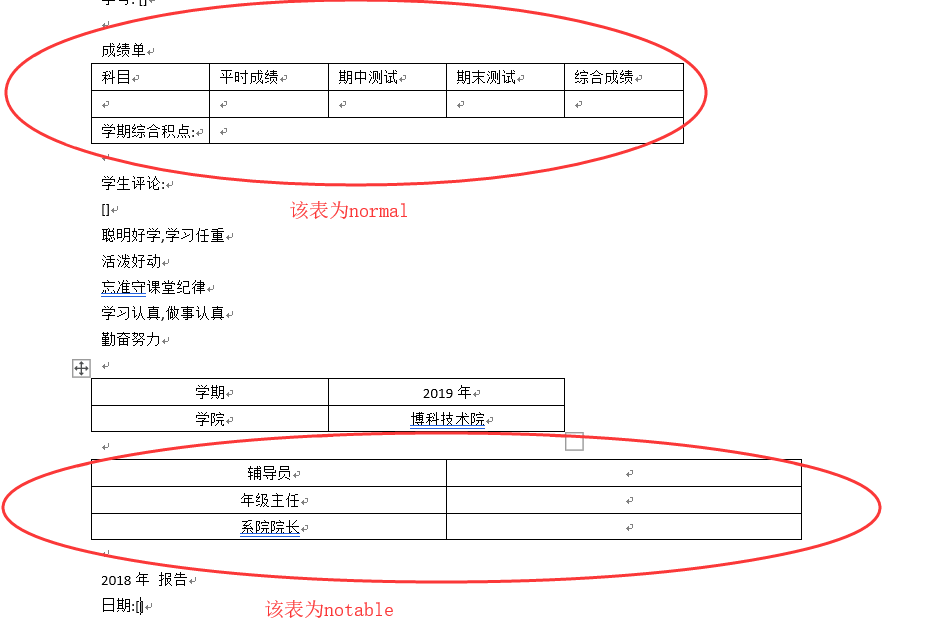
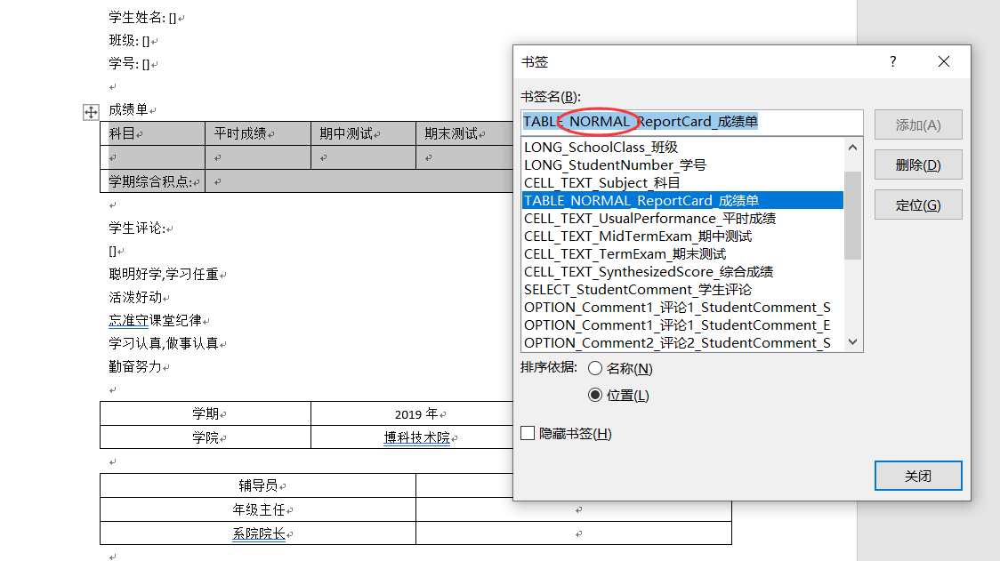
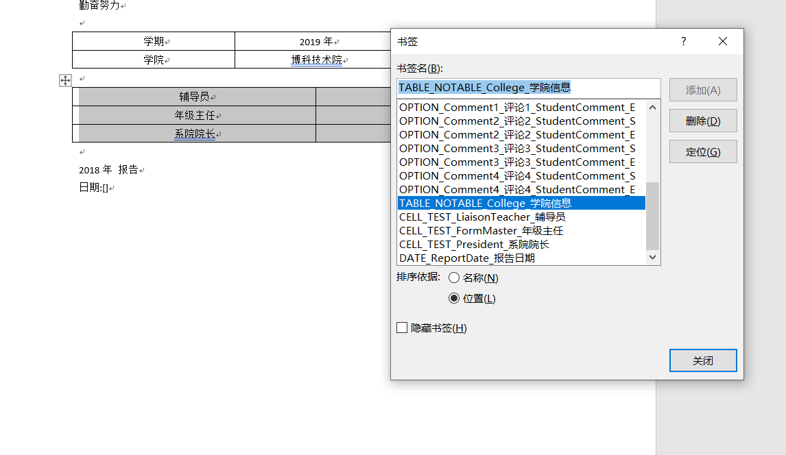
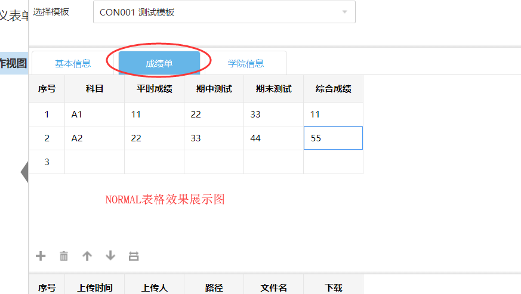
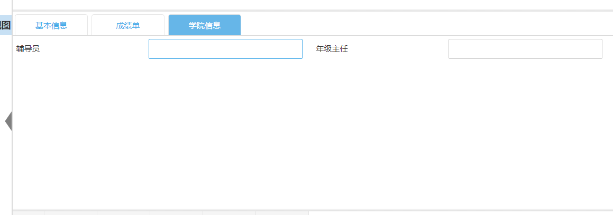

- 对于需要解析的单元格,请以`CELL_${controlltype}_${key}_${caption}`格式
   - CELL 固化,其实,这个更类似`controlltype`的含义
   - controlltype 控件类型,包含了数据类型
   - key 控件的key,请不要在table内重复,table的控件,全名是${tablekey}_${cellkey}
   - caption 单元格展示名称
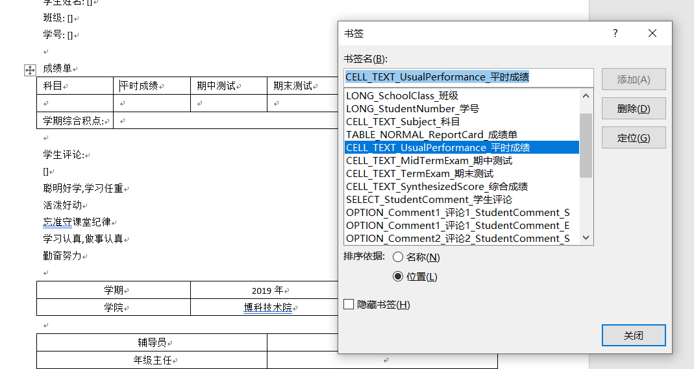
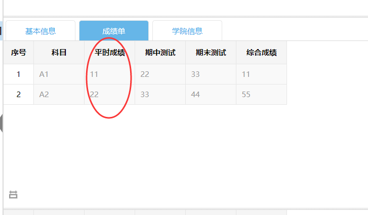