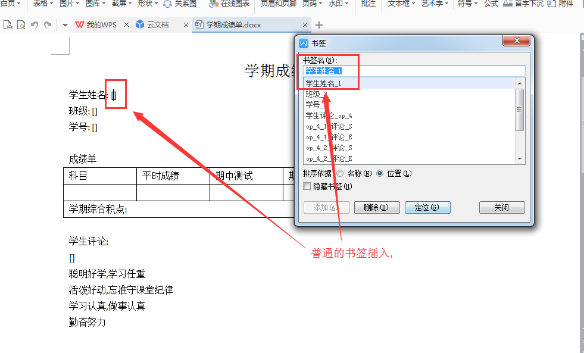
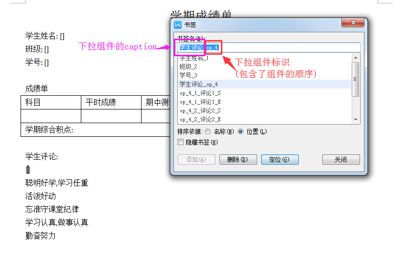
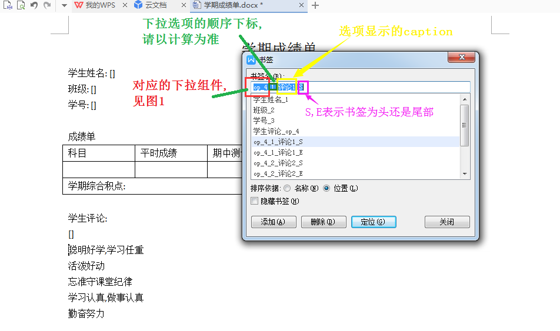
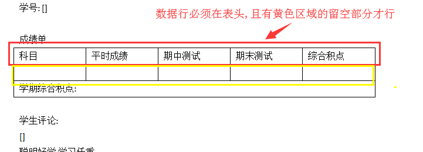
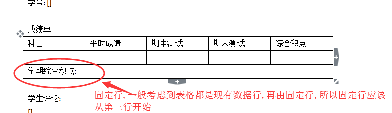

### Word文件(.docx)书签转单据JSON工具

#### 功能描述

通过Word文件(.docx)中,按规则插入书签,编辑表格,再通过在工具提供的API，将其转译成结构化的JSON


#### 书签规则

1. 书签-普通填充型控件

   

   组件显示名(caption),组件序号,以"_"为连接符,如

   ```
   学生姓名_1 #学生姓名=caption,1=组件序号
   ```

2. 书签-下拉选项型控件

   2.1 下拉显示

   

   组件显示名(caption),下拉标识(OP),组件序号,以"_"为连接符,如

   ```
   学生评语_OP_4 #学生评语=caption,OP=下拉标识,4=组件序号
   ```

   2.2 下拉选项

   

   对应下拉组件标识,选项序号,组件显示名(caption),头/尾标识

   ```
   OP_4_1_评论1_S #OP_4=对2.1的下拉控件标识,1=选项序号(第一个), 评论1=caption,S=头标识
   ```

   下拉选项有几点规则

   1. 按位置顺序时,必须先插入S，再插入E
   2. 在SE中，不得插入其他元素的书签
   3. S,E可以跨行


#### 表格规则

1. 数据行

   数据行必须是表格第一行,且第二行必须列数相同,且空着

2. 固定行

   

   固定行,必须从表格第3行开始,且不要表格单元中不要有断行


#### 解析规则

将docx文档解析成2个大部分,Headers（头表)，Tables（明细表）

##### Headers

**书签**部分都都将转译成头表数据元素,以及其控件显示必须品

如果没有[书签-key]映射集合,自动生成其key:

      1. 普通型, key=data+"_"+组件序号

      2. 下拉型, 生成2个元素

         - COMOBOBOX元素,key=data+"_"+组件序号,用于生成下拉控件

         - SHOW元素,key=show+"_"+组件序号,用于显示下拉后对应的选项值,且可以修改显示内容

##### Tables

将所有**表格**转译成明细表元素

如果没有[列名-key]映射集合,自动生成其key:

- 表格名=dtl+"_"+表格序号
- 列名=tab+"_"+表格序号+"_"+列序号

#### API

从指定的docx模板文件中获取单据字段的设计格式的json字符串

```
readWordToJson(String inputUrl,Map<String,String> headRelatedMap,Map<String,String> dtlRelatedMap)
```

- inputUrl docx模板文件的绝对路径
- headRelatedMap 头表控件的[书签-key]映射集合
- dtlRelatedMap 明细表的[列名-key]映射集合

根据Docx模板文件,将传入的数据,按照模板文件的格式,写入到新的docx附件中

```
writeWordToData(String inputUrl, String outputUrl, BillUnit BillUnit)
```

- inputUrl docx模板文件的绝对路径

- outputUrl 生成的docx文件
- BillUnit 单据数据


#### 样例

参见 bokesoft.xialj.office.wordtmpl.demo.DemoTest